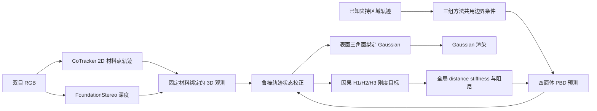

# Embodied Gaussians：手术软组织重建与在线物理参数更新

本项目在 [Physically Embodied Gaussian Splatting](https://embodied-gaussians.github.io/) 的统一视觉—物理表示上，扩展了面向手术软组织牵拉的完整实验链路：使用 SuFIA/Orbit Surgical 的官方 PSM 器械资产生成专属双目仿真数据，将 Gaussian 外观绑定到可变形 PBD 表面，通过 RGB 跟踪和 RGB 估计深度在线修正物理状态，并因果更新组织的全局 distance stiffness 与阻尼，最后同时评估当前状态重建和未来形变预测。

本仓库是独立副本 `embodied_gaussians_fixed_super_best_sim`，不会修改原始的 `embodied_gaussians_fixed_super_best`。

> 当前正式结论：RGB 轨迹校正是误差下降的主要来源；在线刚度更新对三个数据集的未来 3D/2D 跟踪均有稳定改善，但对重建和渲染指标尚未全面超过仅轨迹校正。完整数字见[正式测评结果](#正式测评结果)。

## 1. 项目要解决的问题

给定手术器械牵拉软组织的双目 RGB 序列，项目希望建立一个能够同时回答以下问题的模型：

1. 当前组织表面在哪里，渲染结果是否与观测一致；
2. 在只看到过去和当前帧时，如何用视觉观测纠正 PBD 仿真漂移；
3. 如何根据已经发生的形变在线调整材料参数；
4. 停止视觉校正后，学习到的物理参数能否预测未来 20% 的组织运动。

正式实验不把仿真器的 GT 深度送给算法。GT 轨迹和 GT RGB 只用于最终测评；算法侧深度由 FoundationStereo 从双目 RGB 独立估计。

## 2. 整体流程



系统使用三层相互对应的表示：

- **物理层**：四面体粒子和 distance、volume、shape-matching PBD 约束，负责传播夹持点的运动并保持组织连续性；
- **表面层**：物理粒子的外表面三角面，连接跟踪点、物理节点和渲染属性；
- **视觉层**：绑定在表面三角面上的 3D Gaussian，位置随三角形顶点移动，已有尺度形变逻辑保持不变。

对绑定在三角面顶点 \(i,j,k\) 上的 Gaussian，其中心由固定重心坐标决定：

$$
\boldsymbol{\mu}_g^t = b_i\mathbf{x}_i^t+b_j\mathbf{x}_j^t+b_k\mathbf{x}_k^t,
\qquad b_i+b_j+b_k=1.
$$

因此 Gaussian 不会脱离材料表面；三角面的局部形变同时驱动其尺度变化。夹持区域使用数据集中的已知轨迹作为统一边界条件，并从视觉残差与最终测评点中排除，避免把已知运动当作算法预测能力。

## 3. RGB 轨迹状态校正

### 3.1 从 RGB 得到固定材料点观测

CoTracker 在 RGB 上给出二维轨迹 \((u_m^t,v_m^t)\)，FoundationStereo 给出对应深度 \(D_m^t\)。相机内外参将其反投影为世界坐标：

$$
\mathbf{y}_m^t = \mathbf{T}_{wc}
\left[D_m^t\mathbf{K}^{-1}(u_m^t,v_m^t,1)^\mathsf{T}\right].
$$

每个轨迹只在初始化时绑定到一个物理节点邻域或表面三角面，之后始终跟踪同一材料位置，不会逐帧滑到新的三角面。若其固定插值权重为 \(w_{mi}\)，当前仿真位置为

$$
\hat{\mathbf{y}}_m^t=\sum_iw_{mi}\mathbf{x}_i^t,
\qquad
\mathbf{r}_m^t=\mathbf{y}_m^t-\hat{\mathbf{y}}_m^t.
$$

### 3.2 鲁棒稀疏校正

所有可用轨迹共同求解粒子增量，而不是把单个点直接拖到观测位置：

$$
\Delta\mathbf{x}^{*}=
\arg\min_{\Delta\mathbf{x}}
\sum_m c_m\,\rho\!\left(\|\mathbf{A}_m\Delta\mathbf{x}-\mathbf{r}_m\|_2\right)
+\lambda\|\Delta\mathbf{x}\|_2^2.
$$

其中 \(c_m\) 综合跟踪置信度、双目一致性和可见性，\(\rho\) 为鲁棒损失，\(\mathbf{A}_m\) 是固定材料绑定的插值矩阵。正式配置使用：位置增益 0.70、绝对位置权重 0.85、24 次求解迭代、5 mm 鲁棒阈值、单帧位置校正上限 2 mm。速度由相邻校正状态因果更新，增益 0.20、上限 0.06 m/s。

这一步在后文称为“轨迹校正”。GUI 仍保留原项目的像素级 visual residual 模式；正式 A/B/C 测评采用更可复现的 `trajectory` 模式，即 RGB 跟踪加 FoundationStereo 深度的材料点校正。

## 4. 因果刚度与阻尼更新

当前正式 C 组采用**一个全局 distance stiffness 和一个全局阻尼**，不是六区域、十二区域或逐粒子刚度。代码中的十二个空间组只用于构造抗离群的损失统计，绝不代表十二个材料参数。

参数使用对数形式以保证非负：

$$
k_d=k_{d,0}\exp(\theta_k),
\qquad
\gamma=\gamma_0\exp(\theta_\gamma),
\qquad
\boldsymbol\theta=(\theta_k,\theta_\gamma).
$$

正式配置的初值为 \(k_{d,0}=0.20\)、\(\gamma_0=10\ \mathrm{s}^{-1}\)；shape stiffness 固定为 0.004，volume stiffness 固定为 \(10^{10}\)，夹持耦合固定为 1。

每个时间点只使用最近三个已经发生的转移构造 H1/H2/H3 目标。H1、H2、H3 表示一个、两个、三个时间步的因果预测跨度，不是三个数据集，也不是三个空间区域。轨迹项采用分布鲁棒汇总：

$$
L_{\mathrm{track}}=
0.85L_{\mathrm{mean}}
+0.10L_{\mathrm{group}}
+0.05L_{\mathrm{tail}},
$$

其中 \(L_{\mathrm{group}}\) 是十二个固定空间组的等权均值，\(L_{\mathrm{tail}}\) 强调误差最大的四分之一空间组。总目标为

$$
L(\boldsymbol\theta)=
\sum_{h=1}^{3}\bar\omega_h
\left[0.8L_{\mathrm{track}}^{(h)}+0.2L_{\mathrm{strain}}^{(h)}\right]
+0.4\|\boldsymbol\theta\|_2^2,
\qquad
(\omega_1,\omega_2,\omega_3)=(1.5,2,3).
$$

`distance + volume + shape` 的完整 PBD 时间步参与展开。系统同时计算 Torch 自动微分梯度 \(g_{AD}\) 和 Warp 有限差分梯度 \(g_W\)，只有二者方向足够一致时才允许提交：

$$
\cos(g_{AD},g_W)=
\frac{g_{AD}^{\mathsf T}g_W}{\|g_{AD}\|\,\|g_W\|}\ge 0.95.
$$

通过门控后，由 Warp 梯度驱动 Adam 更新；对数学习率为 0.03、梯度 EMA 为 0.90、单次对数参数变化上限为 0.02。该过程没有离线分支选择，也不会读取未来帧。进入未来 20% 开环阶段后，视觉状态校正和参数提交同时冻结，只保持已经学习到的参数与已知夹持边界向前仿真。

## 5. 数据集

三套数据均为 30 FPS 双目序列，使用 SuFIA/Orbit Surgical 官方 PSM 器械视觉资产；组织、相机、夹持动作和轨迹是为本项目重新构建并录制的专属任务。原始数据体积较大，不随 Git 分发，默认放在 `data/sim/`。

| 编号 | 本地目录 | 动作 | 帧数 | 优化轨迹 | 最终测评点 |
|---|---|---|---:|---:|---:|
| SIM-01 | `tissue_retraction_free_support_front_v2` | 平面 X 方向牵拉 | 300 | 188 | 30 |
| SIM-02 | `tissue_retraction_free_support_side_v2` | 平面 Y 方向牵拉 | 300 | 175 | 30 |
| SIM-03 | `tissue_long_edge_lift_return_sufia_v2_lift30mm` | 从长边侧面夹持、抬升并放回 | 360 | 203 | 30 |

优化轨迹与评估点严格分离。每个数据集最终只用同一份固定的 30 个非夹持点清单报告 3D/2D Tracking Error；优化时不会看到这 30 个点的 GT。三套数据分别生成深度、CoTracker 轨迹、夹持边界和评估清单，不会混用另一数据集的缓存。

## 6. 测评协议

### 6.1 三种方法

| 方法 | PBD | RGB 轨迹校正 | 在线刚度/阻尼更新 |
|---|:---:|:---:|:---:|
| A：纯 PBD | ✓ | — | — |
| B：PBD + 轨迹校正 | ✓ | ✓ | — |
| C：B + 在线物理参数更新 | ✓ | ✓ | ✓ |

三组方法使用完全相同的初始状态、PBD 参数、相机、帧率和已知夹持区域轨迹。B/C 的状态校正参数相同，C 只额外开启因果材料参数更新。

### 6.2 两种能力

- **7:1 重建**：参考 EH-SurGS 的抽帧思想，每七帧观测后留一帧检查当前状态重建；更新和评分严格按时间顺序进行。
- **80/20 未来预测**：前 80% 序列允许视觉状态校正和在线参数更新；最后 20% 完全关闭二者，以前 80% 结束时的状态和参数进行开环预测。

因此正式实验是 3 种方法 × 2 种能力 × 3 个数据集，共 18 组，不把“前 80% 在线误差”和“后 20% 开环误差”混成一个指标。

### 6.3 指标

- **3D Tracking Error (mm) ↓**：30 个固定非夹持材料点的世界坐标平均误差；
- **2D Tracking Error (px) ↓**：上述 3D 点投影到有效双目图像后的平均像素误差；
- **PSNR ↑、SSIM ↑、LPIPS ↓**：预测状态经 Gaussian 渲染后与 GT RGB 比较。

## 7. 正式测评结果

结果来自 `outputs/sim_three_datasets_global_only_foundation_complete_v3/`。方向为：3D、2D、LPIPS 越低越好，PSNR、SSIM 越高越好。

### 7.1 7:1 当前状态重建

| 数据集 | 方法 | 3D mm ↓ | 2D px ↓ | PSNR ↑ | SSIM ↑ | LPIPS ↓ |
|---|---|---:|---:|---:|---:|---:|
| SIM-01 | A：纯 PBD | 1.5585 | 15.543 | 19.056 | 0.8381 | 0.4217 |
| SIM-01 | B：轨迹校正 | **0.4985** | **4.852** | **19.970** | 0.8469 | **0.4076** |
| SIM-01 | C：轨迹校正 + 刚度更新 | 0.5007 | 4.907 | **19.970** | **0.8470** | 0.4078 |
| SIM-02 | A：纯 PBD | 1.4335 | 13.424 | 16.425 | 0.8171 | 0.4295 |
| SIM-02 | B：轨迹校正 | **0.3779** | **3.700** | 17.001 | **0.8267** | **0.4176** |
| SIM-02 | C：轨迹校正 + 刚度更新 | 0.3783 | 3.709 | **17.013** | 0.8266 | 0.4179 |
| SIM-03 | A：纯 PBD | 2.2596 | 19.890 | 19.079 | 0.7767 | 0.5488 |
| SIM-03 | B：轨迹校正 | **0.4778** | 4.628 | **21.895** | 0.7933 | 0.5370 |
| SIM-03 | C：轨迹校正 + 刚度更新 | 0.4859 | **4.432** | 21.774 | **0.7948** | **0.5297** |

### 7.2 后 20% 开环未来预测

| 数据集 | 方法 | 3D mm ↓ | 2D px ↓ | PSNR ↑ | SSIM ↑ | LPIPS ↓ |
|---|---|---:|---:|---:|---:|---:|
| SIM-01 | A：纯 PBD | 4.2814 | 42.833 | 16.456 | 0.8160 | 0.4512 |
| SIM-01 | B：轨迹校正 | 1.6501 | 16.091 | 18.412 | 0.8349 | 0.4210 |
| SIM-01 | C：轨迹校正 + 刚度更新 | **1.4865** | **14.481** | **18.719** | **0.8379** | **0.4186** |
| SIM-02 | A：纯 PBD | 4.1152 | 37.595 | 15.476 | 0.7996 | 0.4537 |
| SIM-02 | B：轨迹校正 | 1.3338 | 13.726 | 16.569 | 0.8212 | 0.4266 |
| SIM-02 | C：轨迹校正 + 刚度更新 | **1.3287** | **13.530** | **16.672** | **0.8219** | **0.4260** |
| SIM-03 | A：纯 PBD | 5.9556 | 53.957 | 14.343 | 0.7462 | 0.5653 |
| SIM-03 | B：轨迹校正 | 1.0134 | 9.525 | **20.878** | **0.7972** | **0.5212** |
| SIM-03 | C：轨迹校正 + 刚度更新 | **0.9884** | **8.025** | 20.544 | 0.7925 | 0.5304 |

### 7.3 三数据集均值

| 能力 | 方法 | 3D mm ↓ | 2D px ↓ | PSNR ↑ | SSIM ↑ | LPIPS ↓ |
|---|---|---:|---:|---:|---:|---:|
| 7:1 重建 | A | 1.7505 | 16.286 | 18.187 | 0.8106 | 0.4666 |
| 7:1 重建 | B | **0.4514** | 4.393 | **19.622** | 0.8223 | 0.4540 |
| 7:1 重建 | C | 0.4550 | **4.349** | 19.586 | **0.8228** | **0.4518** |
| 80/20 预测 | A | 4.7841 | 44.795 | 15.425 | 0.7873 | 0.4901 |
| 80/20 预测 | B | 1.3325 | 13.114 | 18.620 | **0.8178** | **0.4563** |
| 80/20 预测 | C | **1.2679** | **12.012** | **18.645** | 0.8174 | 0.4583 |

### 7.4 结果解释

- 与纯 PBD 相比，轨迹校正 B 将重建平均 3D/2D 误差约降低 **74.2%/73.0%**，将未来预测误差约降低 **72.1%/70.7%**，说明 RGB 观测有效抑制了状态漂移。
- 与 B 相比，C 在三个数据集的未来 3D 和 2D 指标上都更低；均值分别再降低 **4.85%** 和 **8.40%**。这说明因果更新后的材料参数在视觉关闭后具有可测量的动力学预测价值。
- C 的重建 3D 均值比 B 高 0.0036 mm，但 2D、SSIM 和 LPIPS 略好。重建阶段每帧都有视觉校正，材料参数的收益容易被状态校正覆盖。
- C 尚未在全部渲染指标上占优：未来 PSNR 略升 0.025 dB，而 SSIM 下降 0.00036、LPIPS 增加 0.0020。当前材料更新首先改善几何轨迹，不应宣称所有图像指标均显著提升。
- 目前的全局参数只能表达整块组织的平均柔软度，不能恢复数据中真实存在的局部柔软度差异。这是下一步局部/连续刚度场更新的主要动机。

完整逐帧指标、预测轨迹、材料诊断、刚度更新信号和运行日志见：

- [三数据集结果说明](outputs/sim_three_datasets_global_only_foundation_complete_v3/README.md)
- [18 组完整总表](outputs/sim_three_datasets_global_only_foundation_complete_v3/comparison_all.md)
- `outputs/sim_three_datasets_global_only_foundation_complete_v3/sim01/`
- `outputs/sim_three_datasets_global_only_foundation_complete_v3/sim02/`
- `outputs/sim_three_datasets_global_only_foundation_complete_v3/sim03/`

逐帧渲染 PNG 约 900 MB，可由轨迹重新生成，因此未纳入 Git；对应的逐帧 PSNR、SSIM、LPIPS CSV 和汇总 JSON 已保留。

## 8. 运行方法

### 8.1 克隆

FoundationStereo 作为子模块固定到本实验使用的版本：

```bash
git clone --recurse-submodules \
  https://github.com/wad157/Embodied_gaussians_fixed_super_best_sim.git
cd Embodied_gaussians_fixed_super_best_sim
```

已有克隆执行：

```bash
git submodule update --init --recursive
```

本机使用两个独立 Conda 环境：

- `eg_codex`：Embodied Gaussians、PBD、重建和测评；
- `eg_sim`：SuFIA/Orbit Surgical 数据生成与资产检查。

原始 RGB 数据、生成深度和模型权重分别放在 `data/` 与 `weights/`，不随仓库分发。更完整的实验历史见 [PROGRESS.md](PROGRESS.md)。

### 8.2 ThinLinc GUI

在 ThinLinc 图形会话内运行，例如打开 SIM-03：

```bash
SIM_DATASET="$PWD/data/sim/tissue_long_edge_lift_return_sufia_v2_lift30mm" \
  bash scripts/run_sim_reconstruction_thinlinc.sh
```

GUI 可观察 RGB、Gaussian 渲染、PBD 组织、PSM 器械和夹持边界，并可切换纯物理、轨迹校正等调试模式。

### 8.3 三数据集正式测评

```bash
bash scripts/run_sim_three_datasets_global_only_complete.sh \
  outputs/sim_three_datasets_global_only_foundation_complete_v4
```

脚本顺序运行 SIM-01/02/03，并为每套数据独立读取对应的 FoundationStereo 深度和 CoTracker 缓存。为保护正式结果，脚本拒绝覆盖已有输出目录；复测时应使用新的目录名。

## 9. 目录结构

```text
embodied_gaussians_fixed_super_best_sim/
├── src/                         # Gaussian、PBD、Warp/Torch 与 GUI 核心代码
├── scripts/                     # 数据生成、重建、测评、诊断和可视化脚本
├── FoundationStereo/            # 固定版本的双目深度子模块
├── data/sim/                    # 本地三套原始仿真数据（Git 忽略）
├── outputs/
│   └── sim_three_datasets_global_only_foundation_complete_v3/
│       ├── comparison_all.md    # 18 组正式总表
│       ├── sim01/               # 逐帧指标、轨迹与材料诊断
│       ├── sim02/
│       └── sim03/
├── 刚度优化方案.md
├── 当前刚度优化方法与运行流程_小白公式版.md
└── PROGRESS.md                  # 数据、实现与实验演进记录
```

## 10. 当前限制与下一步

- 当前 C 组只辨识全局 distance stiffness 与阻尼；恢复局部柔软度需要可观测性约束下的连续或低维局部刚度场，不能简单地给每个粒子独立自由度。
- FoundationStereo 的无效像素和左右一致性误差会直接影响 3D 观测与刚度梯度；仿真 GT 深度仅用于诊断，不能作为正式算法输入。
- 当前已知夹持区域轨迹作为三组方法共同边界条件，实验评估的是夹持之外的组织传播和预测能力，不包含器械—组织接触反演。
- 三套数据都是可控仿真数据。后续迁移到真实 `super` 数据时，2D GT 需要人工标注，3D GT 则由双目深度反投影获得。
- 外观属性在线学习与物理优化已解耦；正式 v3 结果未让外观优化污染物理 rollout 快照。更复杂的外观自适应仍需单独验证其可重复性。

## 11. 参考项目与论文

- [Physically Embodied Gaussian Splatting](https://embodied-gaussians.github.io/)
- [SuFIA-BC / Orbit Surgical](https://orbit-surgical.github.io/sufia-bc/)
- [Real-to-Sim Deformable Object Manipulation: Optimizing Physics Models with Residual Mappings for Robotic Surgery](https://arxiv.org/abs/2309.11656)
- [FoundationStereo](https://github.com/NVlabs/FoundationStereo)

如果使用本仓库，请同时引用上游 Embodied Gaussians：

```bibtex
@inproceedings{
  abouchakra-embodiedgaussians,
  title={Physically Embodied Gaussian Splatting: A Realtime Correctable World Model for Robotics},
  author={Jad Abou-Chakra and Krishan Rana and Feras Dayoub and Niko Suenderhauf},
  booktitle={8th Annual Conference on Robot Learning},
  year={2024},
  url={https://openreview.net/forum?id=AEq0onGrN2}
}
```

本项目为研究原型，不是临床或生产级软件。
